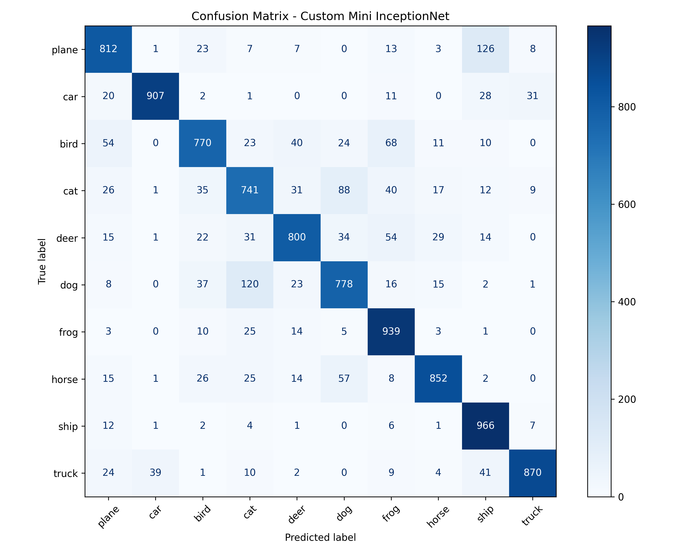

# CIFAR-10 Image Classification with Custom Mini-InceptionNet


## Repository Structure
```text
├── dataset.py         # Data loading and augmentation pipeline
├── model.py           # Custom Mini-InceptionNet architecture definition
├── train.py           # Training loop with Early Stopping & TensorBoard tracking
├── evaluate.py        # Model evaluation and Confusion Matrix generation
├── app.py             # Gradio web interface for real-time inference
├── requirements.txt   # Project dependencies
└── README.md          # Project documentation
```

## Installation & Usage

**1. Clone the repository:**
```bash
git clone https://github.com/MinhHuy128/cifar10-mini-inception.git
cd cifar10-mini-inception
```

**2. Install dependencies:**
```bash
pip install -r requirements.txt
```

**3. Train the model (Optional if you already have the weights):**
```bash
python train.py
```
*This will train the model and save the best weights to `weights/best_model.pth`.*

**4. Evaluate the model:**
```bash
python evaluate.py
```
*This script will output the classification report and generate a `confusion_matrix.png`.*

**5. Run the Web Interface:**
```bash
python app.py
```
*Click the local or public URL provided in the terminal to interact with the Gradio web application.*



